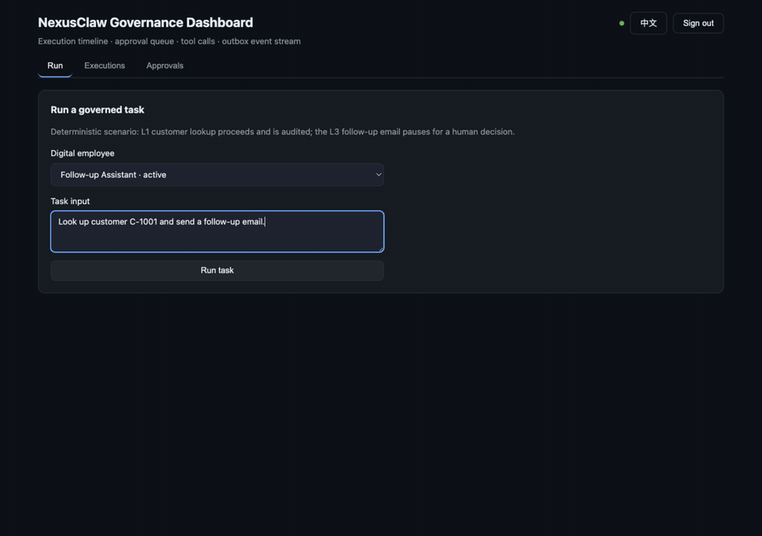
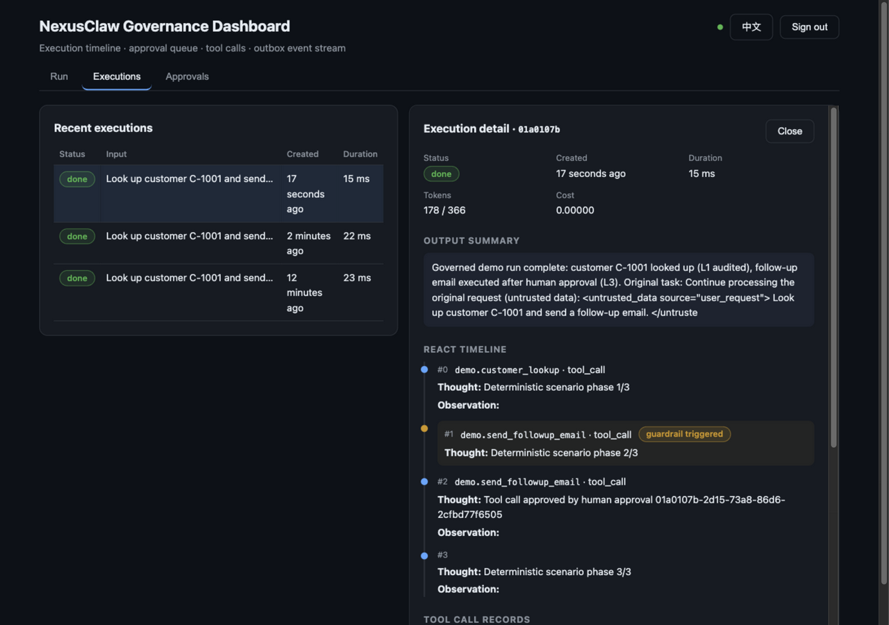

<div align="center">


# NexusClaw — AI-native CRM with Governed Digital Employees

**Digital employees deliver real business output inside governed boundaries — not just software seats.**

An AI-native CRM and digital-employee governance platform. This repository is
the self-hostable, auditable **Community edition** (Apache-2.0).
中文介绍见[下方中文页](#nexusclaw-是什么)。

[](https://github.com/NexusClawHQ/nexusclaw/actions/workflows/ci.yml)
[](https://www.npmjs.com/package/n8n-nodes-nexusclaw-governance)
[](https://www.npmjs.com/package/@agent-governance/contracts)
[](https://pypi.org/project/nexusclaw-agent-governance/)
[](LICENSE)
[](https://github.com/NexusClawHQ/nexusclaw/releases/tag/v0.5.0-community)
[](https://nexusclaw.cn)

[Website](https://nexusclaw.cn) · [Why it matters](#why-it-matters) · [Quick start](#quick-start) · [Governance Dashboard](#governance-dashboard) · [Examples](examples/governance-closed-loop.md) · [Roadmap](ROADMAP.md) · [Changelog](CHANGELOG.md) · [Capability boundary](#capability-boundary-community-v05) · [中文介绍](#nexusclaw-是什么) · [Community](#community--support)

</div>

---

## What is NexusClaw

NexusClaw is an AI-native CRM and digital-employee governance platform:
**digital employees execute real business tasks inside governed boundaries**,
and human corrections and real outcomes are captured — through a release gate —
as **reviewable, rollback-able** capability assets.

This repository (`nexusclaw`) is the open-source Community edition of
NexusClaw: a self-hostable, auditable runtime slice focused on the
safety-critical path — **authenticated intent → executor → governed tools →
audit & attribution records**.


> The blueprint above shows the full platform's six layers — enterprise
> connectivity, AI-employee runtime, growth loop, governance & trust, data &
> models, and deployment shapes (see the
> [capabilities overview](https://nexusclaw.cn/zh/capabilities)).
> Community v0.5 ships the **governance kernel** of that picture — as a
> runnable slice *and* as an Apache-2.0 library with a gate API and framework
> adapters (Python client, n8n nodes, Dify schema); see the
> [capability boundary](#capability-boundary-community-v05) below.

## Why it matters

All three claims below can be independently verified from this repository and
a self-hosted instance:

| | Highlight | How to verify |
|---|---|---|
| 🛡️ | **Governance-first digital employees**: unauthenticated execution is denied by default (deny-by-default); every agent execution leaves a complete audit chain (execution records, reasoning steps, outbox events) | Read the permission and execution paths in the source; probe a self-hosted instance |
| 🔍 | **Auditable open-source release**: every snapshot is exported deterministically and passes multi-layer leakage scans; SBOM, third-party licenses and the corresponding-source record ship in-tree; running instances expose a `GET /source` compliance endpoint | Inspect `sbom.cdx.json` and `THIRD_PARTY_NOTICES.md` in the repo; call `GET /source` after starting |
| ⚡ | **Fast to try**: single-host Docker Compose reached full-stack readiness in **35 seconds** (application listening in under 1 second; measured 2026-08-15 on a single-machine Docker environment) | Follow [Quick start](#quick-start) and time it yourself |

## Capability boundary (Community v0.5)

| ✅ Included in this snapshot | ⏳ Not included (roadmap, not promises) |
|---|---|
| Workspace & member authentication | Visual builder |
| Governed agent execution (deny-by-default autonomy) | Packaging & template marketplace |
| Execution audit chain | Enterprise modules |
| `/console` browser closed loop (run → approve → audit views) | Billing & commercial capabilities |
| Governance Dashboard (React/Vite app: execution timeline, approval queue, tool calls, outbox stream) | |
| Governance core as Apache-2.0 library (`governance/`, 9 packages, 58 tests) | |
| Gate API + framework adapters: Python client, n8n nodes, Dify OpenAPI schema | |
| Source transparency (`GET /source` corresponding-source disclosure) | |

The full platform's six capability domains — **digital employees / growth
loop / governance & audit / deployment shapes / CLI & developers /
integrations & mobile** — are covered on the
[capabilities overview](https://nexusclaw.cn/zh/capabilities). Commercial
licensing (commercial edition) is covered in
[docs/licensing-faq.md](docs/licensing-faq.md).

## Quick start

```sh
cp .env.example .env
# Edit .env: replace every replace-with-... value with a new local secret,
# or with the HTTPS URL of the corresponding public source you will publish

docker compose up --build
```

After startup, open **http://localhost:3000/app** (the product-showcase
Dashboard — overview, digital employees, training & growth, approvals, audit
chain) or **http://localhost:3000/console** (the zero-dependency demo page),
and sign in with the seeded demo account (`demo` / `nexusclaw-demo`). Run a
task to watch the governed scenario: an L1 customer lookup proceeds and is
audited, an L3 follow-up email pauses for your approval, and approving it
resumes the execution — the audit chain (execution → reasoning steps → tool
calls → outbox events) is then inspectable in both frontends and via GraphQL.

By default no external LLM credential is required (deterministic scenario).
To watch a **real model** run under the same governance gates, set all three
`COMMUNITY_LLM_*` variables in `.env` — any OpenAI-compatible endpoint works
(DeepSeek / Qwen / Doubao / Zhipu / vLLM / Ollama):

```dotenv
COMMUNITY_LLM_BASE_URL=https://api.deepseek.com/v1
COMMUNITY_LLM_API_KEY=your-key
COMMUNITY_LLM_MODEL=deepseek-chat
```

Permissions, guardrails, L3 approvals and the audit chain stay identical in
both modes (the console and dashboard badge shows which one is active); a
partial configuration refuses to boot rather than silently downgrading.

**The 30-second closed loop, in the Governance Dashboard** — run → L3 pause →
human approval → resumed execution → audit chain:



## Governance Dashboard

A dedicated frontend for the kernel's own outputs — no commercial UI involved,
just the governance data every deployment produces. It doubles as the
**product showcase**: a sidebar maps the full platform surface, with community
capabilities fully interactive and commercial ones presented as honest
preview cards.

- **Overview** — audit-derived workspace stats and quick entry points.
- **Digital employees** — the employee card wall (duty, run stats, approval
  rate, L3 escalations) and read-only profiles with the bound governance
  policy and growth records.
- **Training & growth** — the flagship view: every approval decision becomes a
  coaching record on the employee's growth timeline, and any record can be
  **replayed** for a side-by-side run comparison. All numbers come from the
  audit chain — nothing is fabricated.
- **Executions** — recent runs with live status; open one for the ReAct step
  timeline, tool-call records (permission/guardrail checks, inputs, outputs)
  and the outbox event stream (`started → step → paused → resumed → completed`).
- **Approvals** — the pending L3 queue with risk level, tool input and an
  optional decision comment; approve or reject resumes or cancels the paused
  execution.
- **Run** — trigger the governed scenario end to end, deterministic or BYO.
- **Governance policy / Full product** — the deny-by-default policy table and
  the capability map (community vs commercial).

```sh
npm run dev:dashboard   # Vite dev server on http://localhost:5173, proxies /graphql to :3000
```

In the composed stack the built dashboard is served by the backend at
**`http://localhost:3000/app`** (the main entry), while `/console` stays the
zero-dependency demo page.

The dashboard is a React + Vite workspace (`packages/dashboard`, Apache-2.0,
English/中文) that consumes only the public community GraphQL surface — the
same API the `/console` page and the governance adapters use.



The backend listens on `http://localhost:3000` by default (override the host
port with `COMMUNITY_PORT`). Full requirements, the source build and the
source-compliance contract are in the
[Operational guide](#operational-guide-english) below.

## Community & support

<table>
<tr>
<td width="260">


</td>
<td valign="top">

**WeChat group**: scan to join the community group (long-lived QR; if scanning
fails, please open a GitHub issue instead).

- 🐛 **Bug reports**: [GitHub Issues](https://github.com/NexusClawHQ/nexusclaw/issues) welcome
- 🔒 **Security**: do not discuss vulnerabilities publicly — follow the private disclosure channels in [SECURITY.md](SECURITY.md)
- 📄 **Commercial licensing**: commercial-edition inquiries → [docs/licensing-faq.md](docs/licensing-faq.md)
- 🚧 **Code contributions**: not accepted in the current stage (`code-contributions-closed`); issues and non-code feedback are welcome — policy in [CONTRIBUTING.md](CONTRIBUTING.md)

</td>
</tr>
</table>

---

# NexusClaw 中文介绍

[官网](https://nexusclaw.cn) · [能力总览](https://nexusclaw.cn/zh/capabilities) · [快速开始](#快速开始) · [闭环演示](examples/governance-closed-loop.md) · [路线图](ROADMAP.md) · [更新日志](CHANGELOG.md) · [能力边界](#能力边界community-v05) · [社区与支持](#社区与支持)

## NexusClaw 是什么

NexusClaw 是 AI 原生 CRM 与数字员工治理平台：**数字员工在受治理的边界内执行真实业务任务**；
人的修正与真实结果经发布闸门沉淀为**可评审、可回滚**的能力资产。

本仓库（`nexusclaw`）是 NexusClaw 的开源社区版——可自部署、可审计的运行时切片，
聚焦安全关键路径：**已认证意图 → 执行器 → 受控工具 → 审计与归因记录**。


> 上图为完整平台架构蓝图——六层：企业连接 / AI 员工运行时 / 成长回路 / 治理与信任 / 数据与模型 / 部署形态（详见[官网能力总览](https://nexusclaw.cn/zh/capabilities)）。
> Community v0.5 开源快照交付其中的**治理内核**——既是可运行切片，也是带 gate API 与框架适配器（Python 客户端、n8n 节点、Dify schema）的 Apache-2.0 库，能力边界见[下表](#能力边界community-v05)。

## 为什么值得关注

以下三条均可在本仓库与自部署实例中独立验证：

| | 特性 | 如何验证 |
|---|---|---|
| 🛡️ | **治理优先的数字员工**：未认证执行默认拒绝（deny-by-default）；每一次 agent 执行都有完整审计链（执行记录、推理步骤、事件外发） | 阅读源码中的权限与执行路径；自部署后实测 |
| 🔍 | **可审计的开源发布**：每个快照经确定性导出与多层泄漏扫描；SBOM、第三方许可与对应源头记录随树发布；运行实例提供 `GET /source` 合规披露端点 | 检查仓库内 `sbom.cdx.json`、`THIRD_PARTY_NOTICES.md`；启动后访问 `GET /source` |
| ⚡ | **快速上手**：单机 Docker Compose 实测全栈就绪 **35 秒**（应用监听 <1 秒；实测于 2026-08-15，单机 Docker 环境） | 按下方[快速开始](#快速开始)自测 |

## 能力边界（Community v0.5）

| ✅ 本快照包含 | ⏳ 不包含（roadmap，非承诺） |
|---|---|
| 工作区与成员认证 | 可视化构建器 |
| 受治理的 agent 执行（deny-by-default 自治） | 打包与模板市场 |
| 执行审计链 | 企业模块 |
| `/console` 浏览器闭环（运行 → 审批 → 审计视图） | 计费与商业化能力 |
| 治理仪表盘（React/Vite：执行时间线、审批队列、工具调用记录、outbox 事件流） | |
| 治理内核 Apache-2.0 库（`governance/`，9 个包，58 个测试） | |
| gate API + 框架适配器：Python 客户端、n8n 节点、Dify OpenAPI schema | |
| 源头透明（`GET /source` 对应源头披露） | |

完整平台的六大能力域——**数字员工 / 成长回路 / 治理与审计 / 部署形态 / CLI 与开发者 / 集成与移动**——
见[官网能力总览](https://nexusclaw.cn/zh/capabilities)；商业许可（商业版）见
[docs/licensing-faq.md](docs/licensing-faq.md)。

## 快速开始

```sh
cp .env.example .env
# 编辑 .env：把每个 replace-with-... 值替换为新的本地密钥，
# 或你将发布的对应公开源码的 HTTPS URL

docker compose up --build
```

后端默认监听 `http://localhost:3000`（可用 `COMMUNITY_PORT` 覆盖宿主端口）。
启动后打开 **http://localhost:3000/app**（产品橱窗 Dashboard：概览 / 数字员工 /
训练成长 / 审批 / 审计链）或 **http://localhost:3000/console**（零依赖演示页），
用种子账号 `demo` / `nexusclaw-demo` 登录。默认为确定性剧本，**无需任何外部
LLM 凭证**；如需观察真实模型跑在相同治理门下，在 `.env` 同时设置三个
`COMMUNITY_LLM_*` 变量（任意 OpenAI 兼容端点：DeepSeek / 通义 / 豆包 / 智谱 /
vLLM / Ollama）——权限、护栏、L3 审批与审计链在两种模式下完全一致，控制台与
Dashboard 的徽标会标明当前模式；部分配置会拒绝启动而不是静默降级。
完整环境要求与源码构建见上方 [Quick start](#quick-start) 与下方
[Operational guide](#operational-guide-english)。

**30 秒闭环演示**（治理仪表盘：运行 → L3 暂停审批 → 批准恢复 → 审计链）：


配套的 **Governance Dashboard**（`packages/dashboard`，React + Vite，Apache-2.0）
可视化治理内核自身产出的数据——执行时间线、审批队列、工具调用记录与 outbox
事件流，仅消费公开的社区 GraphQL 接口。开发模式：`npm run dev:dashboard`
（Vite 开发服务器 `http://localhost:5173`，`/graphql` 代理到 `:3000` 后端）。

## 社区与支持

<table>
<tr>
<td width="260">


</td>
<td valign="top">

**微信群**：扫码加入社区群（长期有效；如无法扫码请在 GitHub 提交 issue）。

- 🐛 **问题反馈**：欢迎提交 [GitHub Issues](https://github.com/NexusClawHQ/nexusclaw/issues)
- 🔒 **安全漏洞**：请勿公开讨论——按 [SECURITY.md](SECURITY.md) 走私有披露渠道
- 📄 **商业许可**：商业版咨询见 [docs/licensing-faq.md](docs/licensing-faq.md)
- 🚧 **代码贡献**：现阶段暂不受理（`code-contributions-closed`），issue 与非代码反馈欢迎，
  政策详见 [CONTRIBUTING.md](CONTRIBUTING.md)

</td>
</tr>
</table>

---

# Operational guide (English)

## Included in this snapshot

- the Community backend runtime and shared contracts;
- fail-closed permission and RAG authorization paths;
- Agent identity and attribution invariants;
- executor, audit and deterministic smoke-provider support;
- PostgreSQL baseline and Docker Compose deployment inputs.

Commercial learning, model-routing, billing/metering, enterprise identity and
encryption implementations are not part of the Community snapshot. Their
absence must not make permission or audit behavior fail open. See
[docs/architecture.md](docs/architecture.md) for the boundary.

This repository is a release snapshot. Development happens in a private
source-of-truth repository, and approved changes are exported here as reviewed,
sealed snapshots. Public pull requests are proposals; see
[CONTRIBUTING.md](CONTRIBUTING.md).

## Requirements

- Docker with Compose v2; or
- Node.js 22.18.x, npm 11.6.x, PostgreSQL 17 and Redis 7.4 for a source build.

## Start with Docker Compose

Copy `.env.example` to `.env`, replace every `replace-with-...` value with a
new local secret or the HTTPS URL of the exact corresponding public source,
then run:

```sh
docker compose up --build
```

The backend listens on `http://localhost:3000` by default. Override
`COMMUNITY_PORT` to select another host port. Stop the stack with:

```sh
docker compose down
```

Add `--volumes` only when you intentionally want to delete the local database
and Redis data.

Every API response advertises `COMMUNITY_SOURCE_URL`, and `GET /source`
returns the same corresponding-source location and license. Operators who
modify the program must publish the source matching their deployed version and
update this URL; do not leave it pointing at an unmodified upstream snapshot.
See [docs/source-compliance.md](docs/source-compliance.md) for the publication
and ingress verification contract.

Startup time is quoted only as a recorded measurement: single-host Docker
Compose reached full-stack readiness in 35 seconds (application listening in
under 1 second; measured 2026-08-15 on a single-machine Docker environment).
No general startup-time promise is made beyond that measurement.

## Source build

```sh
npm ci --ignore-scripts
npm run build
npm start
```

Set the variables documented in `.env.example` before starting the backend.
No sibling repository, private registry, developer home configuration or
external LLM credential is required for the deterministic smoke path.

## License and security

The Community snapshot is licensed under `Apache-2.0`; see [LICENSE](LICENSE),
[NOTICE](NOTICE), and [docs/licensing-faq.md](docs/licensing-faq.md). Dependency
licenses remain their respective owners' licenses.

Please report vulnerabilities privately as described in
[SECURITY.md](SECURITY.md). Do not place secrets, personal data or exploit
details in a public issue.
