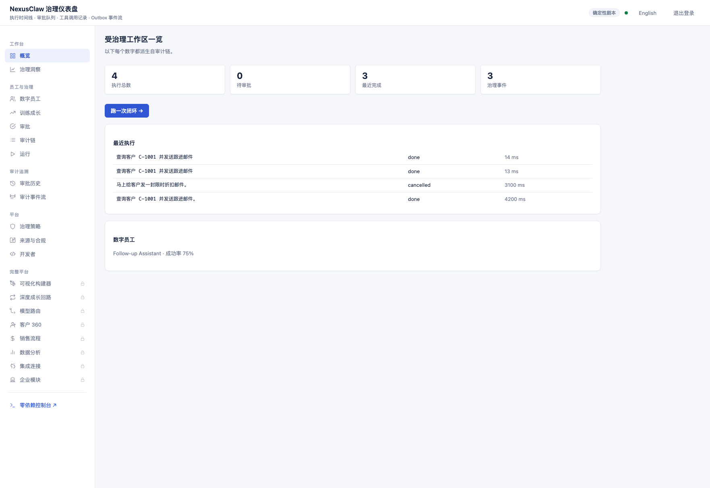
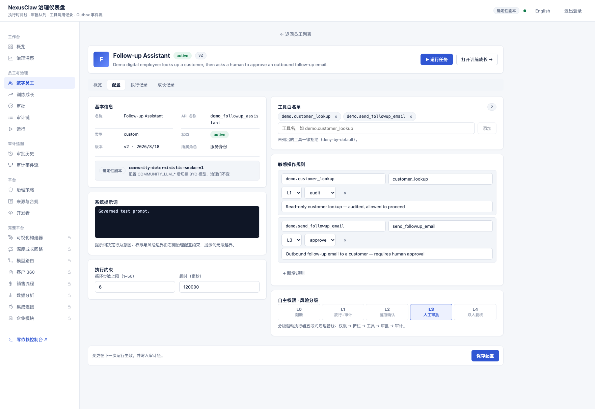
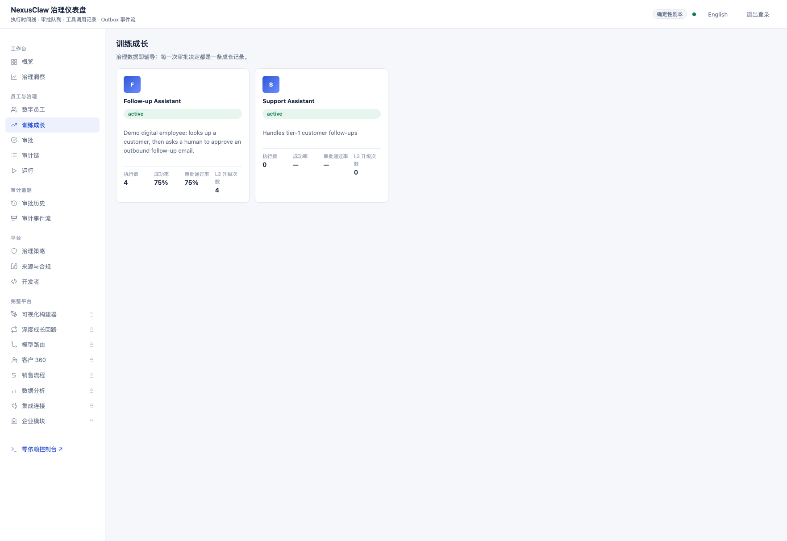
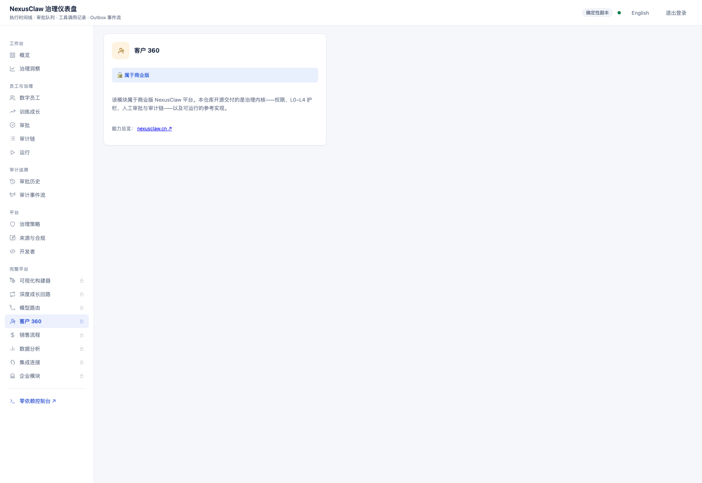

<div align="center">

# agent-governance

**The deny-by-default governance kernel for AI agents.**

Permissions · L0–L4 guardrails · human approvals · immutable audit chain —
as an Apache-2.0, framework-neutral library.

[](https://github.com/NexusClawHQ/nexusclaw-agent-governance/actions/workflows/ci.yml)
[](https://www.npmjs.com/package/@agent-governance/contracts)
[](https://www.npmjs.com/package/n8n-nodes-nexusclaw-governance)
[](https://pypi.org/project/nexusclaw-agent-governance/)
[](LICENSE)

Built by [NexusClaw](https://nexusclaw.cn) — the AI-native CRM with governed
digital employees — from the kernel that runs its production executions.

[Quick start](#quick-start) · [Packages](#packages) · [Adapters](#adapters) ·
[Reference implementation](#reference-implementation) · [中文介绍](#agent-governance-中文介绍)

</div>

---

## What this is

Every agent execution starts with **nothing allowed**: no tool, no object, no
operation. Access is granted only through an explicit, auditable policy — and
every grant, denial, approval and execution step is written to an **immutable
audit chain**. That is the problem this library solves — and it solves it
without owning your agent. Keep your framework (LangGraph, CrewAI, n8n, Dify,
or a plain script), route your tool calls through the gate API, and the kernel
handles permissions, risk evaluation, human approval pauses and audit records.

This repository is the open-source (Apache-2.0) governance kernel that runs
NexusClaw's digital employees in production, shipped in three forms:

1. **Library** — nine framework-neutral npm packages under [`governance/`](governance/README.md)
   (zero-dependency core packages), plus framework adapters (Python, n8n, Dify).
2. **Gate API** — a sidecar HTTP surface: `POST /gate` decides, `/gate/:id/complete`
   records the outcome. Any framework can adopt it in three lines.
3. **Reference implementation** — a runnable full-stack slice (backend +
   browser console + dashboard, Docker Compose) that exercises the kernel
   end-to-end with a deterministic scenario. No external LLM credential is
   required; or bring your own model through any OpenAI-compatible endpoint
   and watch a real model run under the same gates.

## Why it matters

Every claim below is independently verifiable from this repository:

| | Claim | How to verify |
|---|---|---|
| 🛡️ | **Deny by default**: unauthenticated/ungranted execution is denied; every grant, denial, pause and approval lands on the audit chain (execution → reasoning steps → tool calls → outbox events) | Read the executor loop in [`governance/packages/executor`](governance/packages/executor/src/executor-engine.ts); probe a running instance |
| 🧪 | **Tested**: 162 tests in this tree, 58 in the kernel — including property tests and real-Postgres integration tests | `npx vitest run` at the root, or `pnpm verify` in `governance/` |
| ⚡ | **Fast to adopt**: gate your own framework's tool in three lines — no migration of your agent loop | [Demo C — gate your own agent](examples/governance-closed-loop.md#demo-c--gate-your-own-agent-in-three-lines) |
| 🔍 | **Auditable release**: every snapshot is exported deterministically and passes multi-layer leakage scans; SBOM, third-party licenses and the corresponding-source record ship in-tree; running instances expose a `GET /source` compliance endpoint | Inspect `sbom.cdx.json` and `THIRD_PARTY_NOTICES.md`; start the reference slice and call `GET /source` |

## Quick start

### A — Adopt the kernel

```sh
npm install @agent-governance/contracts        # the dependency-free contracts
# or, for the Python client:
pip install nexusclaw-agent-governance
```

Gate a tool of **your** agent in three lines:

```python
from agent_governance import GovernanceClient

gov = GovernanceClient("http://127.0.0.1:7899")        # the sidecar
update_customer = gov.wrap_tool(update_customer)        # gated + audited
```

Every wrapped call asks the sidecar whether the tool may run: `allow` executes
locally and reports the outcome, `blocked` raises `GovernanceDenied`, and an
L2/L3 risk raises `GovernancePendingApproval` — wire that to your framework's
human-in-the-loop, then `gov.decide(...)` and `gov.run_approved(...)`.

The three closed-loop demos — browser, terminal, and gating your own agent —
are in [examples/governance-closed-loop.md](examples/governance-closed-loop.md).
No private code and no external LLM credential is needed for any of them.

### B — Run the reference slice

```sh
cp .env.example .env
# Edit .env: replace every replace-with-... value with a new local secret,
# or with the HTTPS URL of the corresponding public source you will publish

docker compose up --build
```

Open **http://localhost:3000/console** (the zero-dependency browser demo) or
**http://localhost:3000/app** (the reference dashboard) and sign in with the
seeded demo account (`demo` / `nexusclaw-demo`). Run the task to watch the
governed scenario: an L1 customer lookup proceeds and is audited, an L3
follow-up email pauses for your approval, and approving it resumes the
execution — the audit chain is then inspectable in both frontends and via
GraphQL.

By default no external LLM credential is required (deterministic scenario).
To watch a **real model** run under the same governance gates, set the three
`COMMUNITY_LLM_*` variables in `.env` — any OpenAI-compatible endpoint works
(DeepSeek / Qwen / Doubao / Zhipu / vLLM / Ollama):

```dotenv
COMMUNITY_LLM_BASE_URL=https://api.deepseek.com/v1
COMMUNITY_LLM_API_KEY=your-key
COMMUNITY_LLM_MODEL=deepseek-chat
```

Permissions, guardrails, L3 approvals and the audit chain stay identical in
both modes (the console and dashboard badge shows which one is active); a
partial configuration refuses to boot rather than silently downgrading.

## Packages

The kernel is a set of framework-neutral npm packages under
[`governance/packages/`](governance/README.md) (Apache-2.0, published on npm):

| Package | Responsibility |
|---|---|
| `@agent-governance/contracts` | Ports and versioned wire contracts — the dependency-free seam |
| `@agent-governance/permission` | Deny-by-default tool access, RAG authorization, data-scope filters, field masking |
| `@agent-governance/guardrail` | L0–L4 risk rules |
| `@agent-governance/approval` | Human-in-the-loop pause/resume |
| `@agent-governance/audit-chain` | Executions → steps → tool calls → outbox events |
| `@agent-governance/outbox` | Transactional audit event delivery (PG NOTIFY default) |
| `@agent-governance/governor` | Rate and context limits |
| `@agent-governance/executor` | The governed ReAct loop assembling all packages |
| `@agent-governance/sidecar` | HTTP surface: governed scenario endpoints, the per-call gate API, a mini console |

## Adapters

Same gate API, different frameworks — no custom integration code:

- **Python** ([`governance/adapters/python`](governance/adapters/python/README.md)) —
  zero-dependency client (`wrap_tool`, `run_approved`), PyPI package
  `nexusclaw-agent-governance`.
- **n8n** ([`governance/adapters/n8n`](governance/adapters/n8n)) — Governance
  Gate / Approve / Pending nodes, published on npm as
  `n8n-nodes-nexusclaw-governance`.
- **Dify** ([`governance/adapters/dify`](governance/adapters/dify)) —
  importable OpenAPI schema for the custom-tool surface.

## Reference implementation

`packages/backend` + `packages/dashboard` + `packages/shared` form a runnable
reference slice: it exercises the kernel's own contracts end-to-end — the same
GraphQL surface the adapters use. It is a **demonstration of the kernel**, not
the NexusClaw product; everything it ships is listed in this repository and
described below.

- **`/console`** — the zero-dependency browser closed loop: run → L3 pause →
  approve → resumed execution → audit timeline.
- **Reference dashboard** (`packages/dashboard`, React + Vite, Apache-2.0,
  English/中文) — visualizes the kernel's own outputs: execution timeline,
  approval queue, tool-call records (permission/guardrail checks, inputs,
  outputs), outbox event stream and an audit-derived growth timeline. It also
  lets you **configure the employee policies** behind those runs — prompt,
  tool allow-list, L0–L4 sensitive-op rules and execution constraints — with
  every change written to the audit chain. All numbers come from the audit
  chain — nothing is fabricated.

The 30-second closed loop, from run to audit chain:


The dashboard, screen by screen:









Optional: host an anonymous playground for visitors — a 60-second governed
closed loop with no signup, no Docker on their side:

```sh
docker compose --profile playground up -d
# open http://localhost:3002/playground
```

The playground shares the stack but runs with `COMMUNITY_DEMO_SEED=false` and
`PLAYGROUND_PROFILE=true`: every visitor gets an isolated throwaway workspace
(auto-recycled after 30 idle minutes), the deterministic dry-run scenario only,
per-IP rate limits, and BYO model variables are refused on this surface —
anonymous hosting stays credential-free.

## What is in this repository, and what is not

Everything in this repository is Apache-2.0 and listed above: the governance
kernel library, its adapters, and the reference implementation slice.

The commercial NexusClaw platform additionally includes a visual builder,
packaging/template marketplace, commercial learning and model-routing loops,
billing/metering, and enterprise identity/encryption modules. Those stay
commercial — see [docs/licensing-faq.md](docs/licensing-faq.md). Their absence
from this repository must never make permission or audit behavior fail open:
the reference slice implements conservative policies or reports a stable
unavailable-capability code ([docs/architecture.md](docs/architecture.md)).

## Auditability of this release

This repository is a release snapshot. Development happens in a private
source-of-truth repository; approved changes are exported here as reviewed,
sealed snapshots (provenance record in
[`.nexusclaw-public-source.json`](.nexusclaw-public-source.json); policy in
[docs/snapshot-export-policy.md](docs/snapshot-export-policy.md)). The
snapshot pipeline is guarded by
[`scripts/check-community-boundary.mjs`](scripts/check-community-boundary.mjs)
so an exclusion-based export can never re-leak enterprise assets. Dependency
and file-level licenses ship in-tree (`sbom.cdx.json`, `THIRD_PARTY_NOTICES.md`,
`file-licenses.json`).

Operators who deploy the reference slice must publish the source matching
their deployed version and configure `COMMUNITY_SOURCE_URL`; every API
response advertises it and `GET /source` returns it — see
[docs/source-compliance.md](docs/source-compliance.md).

## Community & support

<table>
<tr>
<td width="260">


</td>
<td valign="top">

**WeChat group**: scan to join the community group (long-lived QR; if scanning
fails, please open a GitHub issue instead).

- 🐛 **Bug reports**: [GitHub Issues](https://github.com/NexusClawHQ/nexusclaw-agent-governance/issues) welcome
- 🔒 **Security**: do not discuss vulnerabilities publicly — follow the private disclosure channels in [SECURITY.md](SECURITY.md)
- 📄 **Commercial licensing**: commercial-edition inquiries → [docs/licensing-faq.md](docs/licensing-faq.md)
- 🚧 **Code contributions**: not accepted in the current stage (`code-contributions-closed`); issues and non-code feedback are welcome — policy in [CONTRIBUTING.md](CONTRIBUTING.md)

</td>
</tr>
</table>

---

# agent-governance 中文介绍

[快速开始](#快速开始) · [包](#包) · [适配器](#适配器) · [参考实现](#参考实现) ·
[仓库内容边界](#仓库内容边界) · [社区与支持](#社区与支持)

## agent-governance 是什么

agent-governance 是**面向 AI 代理的默认拒绝（deny-by-default）治理内核**：
每次执行从"什么都不允许"开始，任何工具、对象、操作的访问只能通过显式、
可审计的策略获得；每一次授权、拒绝、暂停、审批与执行步骤都会写入**不可变
审计链**。它不接管你的代理——保留你自己的框架（LangGraph / CrewAI / n8n /
Dify 或普通脚本），把工具调用接入 gate API，权限、L0–L4 风险规则、人工审批
与审计记录就交给内核。

本仓库是运行 NexusClaw 生产数字员工的治理内核的开源（Apache-2.0）版本，
由 [NexusClaw](https://nexusclaw.cn)（AI 原生 CRM 与数字员工治理平台）出品，
以三种形态交付：

1. **库**——`governance/` 下九个框架无关的 npm 包（核心包零运行时依赖），
   以及 Python / n8n / Dify 适配器；
2. **gate API**——sidecar HTTP 接口：`POST /gate` 裁决，`/gate/:id/complete`
   记录结果，三行代码接入任意框架；
3. **参考实现**——可运行的全栈切片（后端 + 浏览器控制台 + 仪表盘，
   Docker Compose），用确定性场景端到端演示内核；无需外部 LLM 凭证，
   也可通过任意 OpenAI 兼容端点接入真实模型、在相同治理门下运行。

## 快速开始

**A — 以库的形式接入**

```sh
npm install @agent-governance/contracts
# 或安装 Python 客户端：
pip install nexusclaw-agent-governance
```

三行代码为你的代理的工具加治理：

```python
from agent_governance import GovernanceClient

gov = GovernanceClient("http://127.0.0.1:7899")        # sidecar
update_customer = gov.wrap_tool(update_customer)        # 受治理 + 可审计
```

三个闭环演示（浏览器 / 终端 / 接入自有代理）见
[examples/governance-closed-loop.md](examples/governance-closed-loop.md)，
均无需私有代码、无需外部 LLM 凭证。

**B — 运行参考实现**

```sh
cp .env.example .env   # 把每个 replace-with-... 替换为本地密钥
docker compose up --build
```

打开 **http://localhost:3000/console**（零依赖演示页）或
**http://localhost:3000/app**（参考仪表盘），用种子账号 `demo` /
`nexusclaw-demo` 登录，运行任务即可观察受治理闭环：L1 客户查询放行并审计、
L3 跟进邮件暂停等待审批、批准后恢复执行、审计链全程可查。默认确定性剧本
无需任何 LLM 凭证；设置 `.env` 中三个 `COMMUNITY_LLM_*` 变量（任意 OpenAI
兼容端点：DeepSeek / 通义 / 豆包 / 智谱 / vLLM / Ollama）即可观察真实模型
在相同治理门下运行——权限、护栏、L3 审批与审计链两种模式完全一致，
部分配置会拒绝启动而不是静默降级。

## 包

`governance/packages/`（Apache-2.0，已发布至 npm）：

| 包 | 职责 |
|---|---|
| `@agent-governance/contracts` | 端口与版本化契约——零依赖接缝 |
| `@agent-governance/permission` | 默认拒绝的工具访问、RAG 授权、数据范围过滤、字段脱敏 |
| `@agent-governance/guardrail` | L0–L4 风险规则 |
| `@agent-governance/approval` | 人工审批暂停/恢复 |
| `@agent-governance/audit-chain` | 执行 → 步骤 → 工具调用 → outbox 事件 |
| `@agent-governance/outbox` | 事务性审计事件投递（默认 PG NOTIFY） |
| `@agent-governance/governor` | 速率与上下文限额 |
| `@agent-governance/executor` | 组装全部包的受治理 ReAct 循环 |
| `@agent-governance/sidecar` | HTTP 面：受治理场景端点、gate API、迷你控制台 |

## 适配器

- **Python**：零依赖客户端（`wrap_tool`、`run_approved`），PyPI 包
  `nexusclaw-agent-governance`
- **n8n**：Governance Gate / Approve / Pending 节点，npm 包
  `n8n-nodes-nexusclaw-governance`
- **Dify**：可导入的 OpenAPI custom-tool schema

## 参考实现

`packages/backend` + `packages/dashboard` + `packages/shared` 构成可运行的
参考切片，端到端走通内核自己的契约（与适配器同一套 GraphQL 面）。它是
**内核的演示，不是 NexusClaw 产品**；仓库里有什么、上文就列了什么：

- **`/console`**——零依赖浏览器闭环：运行 → L3 暂停 → 审批 → 恢复 → 审计时间线；
- **参考仪表盘**（React + Vite，Apache-2.0，中英双语）——可视化内核自身的
  产出：执行时间线、审批队列、工具调用记录（权限/护栏检查、输入输出）、
  outbox 事件流与审计派生的成长时间线。所有数字来自审计链，无任何伪造。

可选：为访客托管匿名 playground——无需注册、无需对方装 Docker 的 60 秒
治理闭环：`docker compose --profile playground up -d` 后打开
`http://localhost:3002/playground`。每位访客获得独立一次性工作区（空闲 30
分钟回收）、仅确定性干跑剧本、按 IP 限流，且该接入面强制禁用 BYO 模型
变量——匿名托管永不接触凭证。

## 仓库内容边界

本仓库内所有内容均为 Apache-2.0 并已在上面列出：治理内核库、适配器、
参考实现切片。

商业版 NexusClaw 平台额外包含：可视化构建器、打包与模板市场、商业学习与
模型路由回路、计费/计量、企业身份与加密模块——这些保持商业（见
[docs/licensing-faq.md](docs/licensing-faq.md)）。它们的缺失不得让权限或
审计行为 fail-open：参考切片实现保守策略或在能力缺失时返回稳定的不可用码
（[docs/architecture.md](docs/architecture.md)）。

## 社区与支持

<table>
<tr>
<td width="260">


</td>
<td valign="top">

**微信群**：扫码加入社区群（长期有效；如无法扫码请在 GitHub 提交 issue）。

- 🐛 **问题反馈**：欢迎提交 [GitHub Issues](https://github.com/NexusClawHQ/nexusclaw-agent-governance/issues)
- 🔒 **安全漏洞**：请勿公开讨论——按 [SECURITY.md](SECURITY.md) 走私有披露渠道
- 📄 **商业许可**：商业版咨询见 [docs/licensing-faq.md](docs/licensing-faq.md)
- 🚧 **代码贡献**：现阶段暂不受理（`code-contributions-closed`），issue 与非代码反馈欢迎，
  政策详见 [CONTRIBUTING.md](CONTRIBUTING.md)

</td>
</tr>
</table>

---

# Operational guide (English)

## Included in this repository

- the governance kernel library and adapters (`governance/`);
- the reference implementation slice: backend runtime, shared contracts,
  browser console and reference dashboard;
- fail-closed permission and RAG authorization paths;
- executor, audit and deterministic smoke-provider support;
- PostgreSQL baseline and Docker Compose deployment inputs.

Commercial learning, model-routing, billing/metering, enterprise identity and
encryption implementations are not part of this repository. Their absence
must not make permission or audit behavior fail open. See
[docs/architecture.md](docs/architecture.md) for the boundary.

This repository is a release snapshot. Development happens in a private
source-of-truth repository, and approved changes are exported here as reviewed,
sealed snapshots. Public pull requests are proposals; see
[CONTRIBUTING.md](CONTRIBUTING.md).

## Requirements

- Docker with Compose v2; or
- Node.js 22.18.x, npm 11.6.x, PostgreSQL 17 and Redis 7.4 for a source build.

## Start with Docker Compose

Copy `.env.example` to `.env`, replace every `replace-with-...` value with a
new local secret or the HTTPS URL of the exact corresponding public source,
then run:

```sh
docker compose up --build
```

The backend listens on `http://localhost:3000` by default. Override
`COMMUNITY_PORT` to select another host port. Stop the stack with:

```sh
docker compose down
```

Add `--volumes` only when you intentionally want to delete the local database
and Redis data.

Every API response advertises `COMMUNITY_SOURCE_URL`, and `GET /source`
returns the same corresponding-source location and license. Operators who
modify the program must publish the source matching their deployed version and
update this URL; do not leave it pointing at an unmodified upstream snapshot.
See [docs/source-compliance.md](docs/source-compliance.md) for the publication
and ingress verification contract.

Startup time is quoted only as a recorded measurement: single-host Docker
Compose reached full-stack readiness in 35 seconds (application listening in
under 1 second; measured 2026-08-15 on a single-machine Docker environment).
No general startup-time promise is made beyond that measurement.

## Source build

```sh
npm ci --ignore-scripts
npm run build
npm start
```

Set the variables documented in `.env.example` before starting the backend.
No sibling repository, private registry, developer home configuration or
external LLM credential is required for the deterministic smoke path.

## License and security

This repository is licensed under `Apache-2.0`; see [LICENSE](LICENSE),
[NOTICE](NOTICE), and [docs/licensing-faq.md](docs/licensing-faq.md). Dependency
licenses remain their respective owners' licenses.

Please report vulnerabilities privately as described in
[SECURITY.md](SECURITY.md). Do not place secrets, personal data or exploit
details in a public issue.
